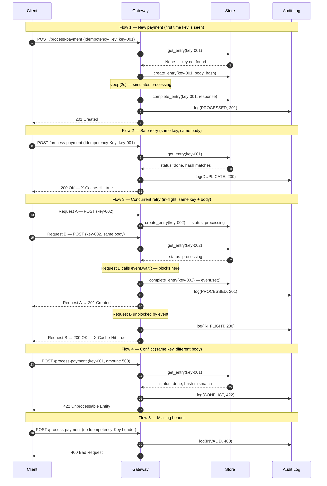

# Idempotency Gateway

A payment processing API that guarantees every payment is processed **exactly once**, no matter how many times the client retries.

---

## The Problem

FinSafe's e-commerce clients occasionally experience network timeouts. When this happens, their servers automatically retry the payment request. Without a safeguard, FinSafe processes both the original and the retry as independent payments — charging the customer twice.

**The result:** customer disputes, regulatory issues, and churn.

---

## The Solution

Every payment request is sent with a unique `Idempotency-Key` header. The server uses this key to detect retries and return the original result instead of processing again. No matter how many times a client retries, the payment executes exactly once.

---

## Getting Started

### Requirements

- Python 3.10+
- pip

### Installation

```bash
pip install fastapi uvicorn
```

### Run the Server

```bash
uvicorn main:app --reload
```

### Interactive API Docs

```
http://localhost:8000/docs
```

---

## Project Structure

```
├── main.py       # FastAPI app and all route handlers
├── store.py      # In-memory payment store with locking
├── models.py     # Pydantic request, response, and audit models
├── audit.py      # Immutable audit log — one entry per request
└── README.md
```

---

## How It Works

### The Idempotency Key

The client generates a unique key (e.g. a UUID) for each payment intent and sends it as a request header:

```
Idempotency-Key: 550e8400-e29b-41d4-a716-446655440000
```

The same key is sent on every retry of the same payment. The server uses this key to look up whether it has already processed this request.

### The Locking System

Two layers of locking prevent race conditions when multiple retries arrive simultaneously:

- **Global lock** — used only to safely create per-key locks without a race
- **Per-key lock** — one lock per idempotency key, serializes concurrent arrivals for the same payment

This means two retries of the same payment arriving at the exact same millisecond will not double-charge. The first one processes, the second one waits, then receives the first one's result.

### The Body Hash

Every request body is fingerprinted with SHA-256 at arrival. This hash is stored alongside the payment entry. If a client reuses a key with a different amount, the hashes will not match and the request is rejected — protecting against both bugs and fraud.

### The Audit Log

Every request that touches the API — whether processed, duplicated, rejected, or invalid — produces exactly one immutable audit entry. Entries are never edited or deleted. This provides a permanent decision trail for every payment attempt.

---

## API Reference

### `POST /process-payment`

Process a payment. Guaranteed to execute at most once per `Idempotency-Key`.

**Headers**

| Header | Required | Description |
|---|---|---|
| `Idempotency-Key` | Yes | Unique string per payment intent |
| `Content-Type` | Yes | Must be `application/json` |

**Request Body**

```json
{
  "amount": 100.00,
  "currency": "GHS"
}
```

| Field | Type | Rules |
|---|---|---|
| `amount` | float | Required, must be greater than 0 |
| `currency` | string | Required, exactly 3 characters (e.g. `GHS`, `USD`) |

**Response Codes**

| Code | Meaning |
|---|---|
| `201` | Payment processed successfully — first time this key was seen |
| `200` | Duplicate request — cached result returned, no charge made |
| `400` | Missing `Idempotency-Key` header |
| `422` | Key already used for a different request body |
| `500` | Unexpected server error |

**Success Response (201)**

```json
{
  "status": "success",
  "message": "Charged 100.0 GHS",
  "idempotency_key": "550e8400-e29b-41d4-a716-446655440000",
  "amount": 100.0,
  "currency": "GHS"
}
```

**Duplicate Response (200)**

Identical body to the original 201, with an added response header:

```
X-Cache-Hit: true
```

---

### `GET /audit-log`

Returns the full audit trail of every request that touched the API, oldest first.

**Response**

```json
[
  {
    "id": 1,
    "timestamp": "2026-04-24T18:00:00Z",
    "idempotency_key": "550e8400-e29b-41d4-a716-446655440000",
    "amount": 100.0,
    "currency": "GHS",
    "outcome": "PROCESSED",
    "status_code": 201
  },
  {
    "id": 2,
    "timestamp": "2026-04-24T18:00:05Z",
    "idempotency_key": "550e8400-e29b-41d4-a716-446655440000",
    "amount": 100.0,
    "currency": "GHS",
    "outcome": "DUPLICATE",
    "status_code": 200
  }
]
```

**Audit Outcomes**

| Outcome | Meaning | HTTP Code |
|---|---|---|
| `PROCESSED` | First request — payment executed | 201 |
| `DUPLICATE` | Same key + same body — served from cache | 200 |
| `CONFLICT` | Same key + different body — rejected | 422 |
| `IN_FLIGHT` | Waited for concurrent request, returned its result | 200 |
| `INVALID` | Missing header or bad input | 400 |

---

### `GET /store-stats`

Returns a summary of keys currently held in memory.

**Response**

```json
{
  "total_keys": 10,
  "active_keys": 8,
  "expired_keys": 2,
  "ttl_seconds": 86400
}
```

---

### `GET /health`

Health check endpoint.

**Response**

```json
{
  "status": "ok"
}
```

---

## Scenarios

### Scenario 1 — Normal Payment

```
Client → POST /process-payment (Idempotency-Key: key-001, amount: 100)
Server → 201 — payment processed, result stored against key-001
```

### Scenario 2 — Safe Retry

```
Client → POST /process-payment (Idempotency-Key: key-001, amount: 100)
Server → 200 — duplicate detected, cached result returned, no charge
```

### Scenario 3 — Concurrent Retries (Race Condition)

```
Client → POST /process-payment (key-001, amount: 100)  ─┐ same millisecond
Client → POST /process-payment (key-001, amount: 100)  ─┘

Request A → acquires lock → processes payment → 201
Request B → waits → receives Request A result → 200

One charge. Two valid responses.
```

### Scenario 4 — Fraud / Bug Detection

```
Client → POST /process-payment (Idempotency-Key: key-001, amount: 500)
Server → 422 — key-001 was already committed to amount: 100
```

### Scenario 5 — Missing Header

```
Client → POST /process-payment (no Idempotency-Key header)
Server → 400 — missing required header
```

---

## Developer's Choice Feature — Payment Audit Log

### Why This Was Added

In production Fintech, regulators require a complete record of every payment decision. If a customer disputes a charge, the operations team needs to answer: was this a duplicate? Was it rejected? Was it processed twice due to a bug?

Without an audit log, none of these questions can be answered after the fact.

### What It Does

Every request that enters the API produces exactly one audit entry at the moment the response is returned. The entry is immutable — it cannot be edited or deleted. The log is append-only.

This means:

- Every successful payment is permanently recorded as `PROCESSED`
- Every retry is permanently recorded as `DUPLICATE`
- Every fraud or bug attempt is permanently recorded as `CONFLICT`
- Every missing-header request is permanently recorded as `INVALID`
- The full timeline of any payment key can be reconstructed from the log at any time

### Design Decisions

**One entry per request, no exceptions** — the log call happens at every return point in the payment handler. There is no code path that exits without writing to the log.

**Immutable entries** — `get_log()` returns a shallow copy of the internal list. Callers cannot modify the log by mutating the returned value.

**Strict outcome enum** — outcomes are enforced by Python's `Enum` class. It is impossible to log an outcome that is not one of the five defined values.

**Separated from payment logic** — `audit.py` has no knowledge of the store, the locks, or the payment flow. It only receives the outcome and metadata at the moment of response. This means the audit layer can never interfere with payment processing.

---

## Sequence Diagram

> GitHub renders this diagram automatically — no image needed.

